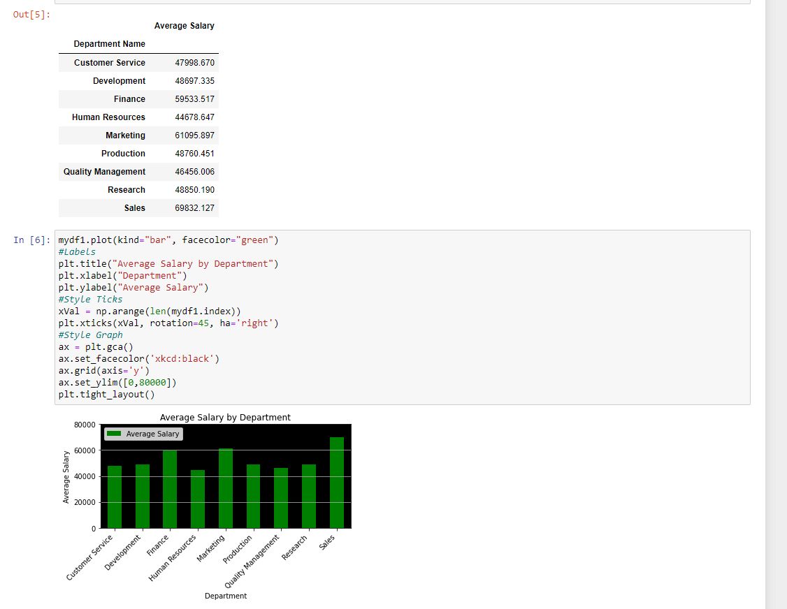
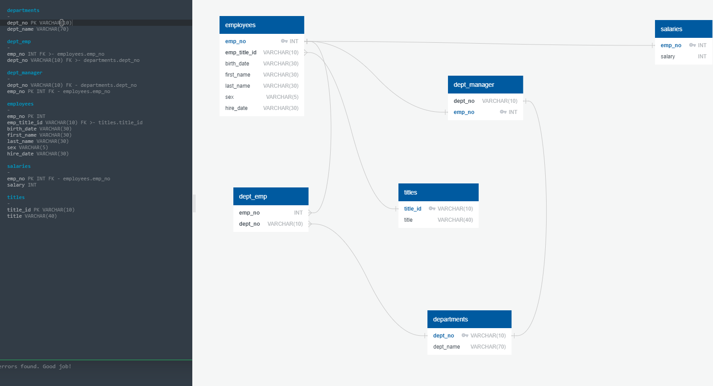

# Company Analysis sqlalchemy
Analyzes company data using sqlalchemy and Python.

### Instructions:
Ensure you have the modules used in the ipynb files installed in your environment. Run JpNbBonus.ipynb in jupyter notebooks.

### Visual:

### Structure

